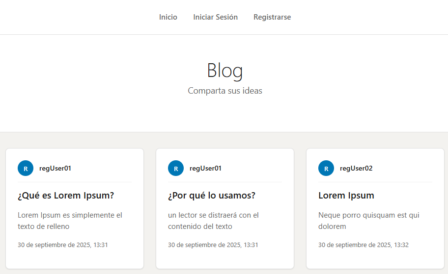

# Aplicativo Tipo Blog

Aplicativo Web el cual permite tanto el registro como la autenticación e inicio de sesión a usuarios. Estos ultimos pueden crear, editar y eliminar sus propias publicaciones. Asimismo, permite la visualización individual de cada publicación.

## Características

### Caraterísticas Principales

- Publicaciones: Crear, Editar y Eliminar (Solo por su respectivo autor).
- Usuarios: Registrar, Iniciar Sesión y Cerrar de Sesión.
- Autenticación: Autorizar al usuario de acceder a los recursos del aplicativo

### Tecnologías

- Python: venv, pip
- JavaScript: Node.JS, Vite
- PostgreSQL

## Stack Tecnológico

### Backend

- FastAPI
- SQLAlchemy
- Pydantic
- JWT

#### Arquitectura de Base de Datos (PostgreSQL)

### Frontend

- React
- React Bootstrap
- React Router / DOM
- Axios

## Instalación con Docker
### Prerrequisitos
- Docker Desktop instalado y abierto en su maquina

### Instalación

#### 1. Clonar
    git clone https://github.com/m4tware/testeo.git

#### 2. Ubicar y abrir el directorio

#### 3. Ejecutar en consola:
    docker compose build --no-cache
    
#### 4. Navegar en:
- Frontend: http://localhost:5173
- Backend: http://localhost:8000
- Documentación: http://localhost:8000/docs ||  http://localhost:8000/redoc

## Manual Usuario

### Registro e Inicio de Sesión

Para el apartado dirigido al acceso del usuario, ambas funcionalidades reciben un nombre de usuario y una contraseña(repetir esta última en caso de registro). En caso de registro efectivo, se solicita inicio de sesión. Al iniciar sesión, se envía al índice del Blog:

**Es importante reslatar que, con fines demostrativos, el tiempo limite de expiración para ls sesión del usuario, es de 5 minutos. Pasado este tiempo se debe volver a iniciar sesión.**

## Eliminación, Edición y Creación de Publicaciones
Las publicaciones a nombre del usuario autenticado, pueden ser tanto eliminadas como editadas:

Si se desea editar, el aplicativo solicita un formulario donde pide como parámetros un nuevo titulo y/o contenido para la publicación, campos opcionales segun el usuario requiera.

Para crear una nueva Publicación, se debe interactuar con el botón mostrado en la parte superior del Blog(recordar que debe estar autenticado):

Posteriormente, se ingresa como parámetros un Titulo y un Contenido

## Consulta individual de Publicación

Al dar click sobre el titulo de una publicación, está se expandirá, permitiendo una vista mas amplia de la misma:

## Usuarios de Prueba
___El aplicativo realiza las operaciones CRUD de manera normal. En caso de inconvenientes con los usuarios de prueba, simplemente y, a su antojo, puede registrarse e iniciar sesión, asmimismo crear, editar y eliminar publicaciones.___

En el volumen se guardó datos de usuarios y publicaciones, por lo que puede iniciar sesión con los siguientes usuarios y contraseña
- contraseña: 
    - user123
- usuarios registrados:
    - regUser01
    - regUser02
    - regUser03