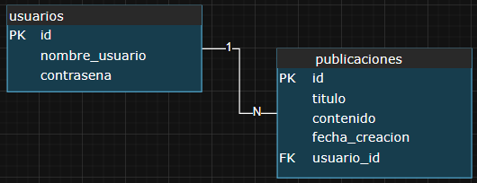

# Aplicativo Tipo Blog

Aplicativo Web el cual permite tanto el registro como la autenticación e inicio de sesión a usuarios. Estos ultimos pueden crear, editar y eliminar sus propias publicaciones. Asimismo, permite la visualización individual de cada publicación.

## Características

### Caraterísticas Principales

- Publicaciones: Crear, Editar y Eliminar (Solo por su respectivo autor).
- Usuarios: Registrar, Iniciar Sesión y Cerrar de Sesión.
- Autenticación: Autorizar al usuario de acceder a los recursos del aplicativo

### Tecnologías

- Python: venv, pip
- JavaScript: Node.JS, Vite
- PostgreSQL

## Stack Tecnológico

### Backend

- FastAPI
- SQLAlchemy
- Pydantic
- JWT

#### Arquitectura de Base de Datos (PostgreSQL)

### Frontend

- React
- React Bootstrap
- React Router / DOM
- Axios

## Instalación con Docker
### Prerrequisitos
- Docker Desktop instalado y abierto en su maquina

### Instalación

#### 1. Clonar
    git clone https://github.com/m4tware/testeo.git

#### 2. Ubicar y abrir el directorio

#### 3. Ejecutar en consola:
    docker compose build --no-cache
    
#### 4. Navegar en:
- Frontend: http://localhost:5173
- Backend: http://localhost:8000
- Documentación: http://localhost:8000/docs ||  http://localhost:8000/redoc

## Usuarios de Prueba
El aplicativo realiza las operaciones CRUD de manera normal. En caso de inconvenientes con los usuarios de prueba, simplemente y, a su antojo, puede registrarse e iniciar sesión, asmimismo crear, editar y eliminar publicaciones.

En el volumen se guardó datos de usuarios y publicaciones, por lo que puede iniciar sesión con los siguientes usuarios y contraseña
- contraseña: 
    - user123
- usuarios registrados:
    - regUser01
    - regUser02
    - regUser03